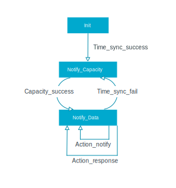

.. _variant_sensor_monitoring:

Sensor monitoring
#################

This sample demonstrates how a temperature sensor communicates over the secure Sidewalk network, which is a simple Sidewalk-based IoT use case.
It requires an edge device (a sensor).
You can find an application server (cloud backend with web UI) compatible with this sample in the `Amazon Sidewalk Sample IoT App`_ repository.

Source file setup
*****************

The application consists of two source files:

* :file:`app.c` (:file:`app.h`) -- The main application file starts the TX and RX thread, assigns button actions to the buttons on the board, and adds received messages to the received message queue.
* :file:`app_sensor.c`, :file:`app_button.c`, :file:`app_led.c` -- The files implement interface between the hardware and sample application.
* :file:`app_rx.c` (:file:`app.h`) -- RX thread reads messages from the received messages queue, deserializes them, and triggers actions.
* :file:`app_tx.c` (:file:`app.h`) -- TX thread sends messages from the device to cloud.
  Depending on the actual state of the device, it sends capability messages or sensor data notifications.

   Application TX thread state machine.

Configuration options
*********************

Before building the Sensor monitoring application variant of the Sidewalk end device, ensure you have enabled the ``OVERLAY_CONFIG="overlay-demo.conf"`` configuration.

The sample variant supports the following Kconfig options:

.. include:: ../../includes/include_kconfig_common.txt

* ``CONFIG_SID_END_DEVICE_NOTIFY_DATA_PERIOD_MS`` -- Enables the notify period of the sensor monitoring end device app in milliseconds.

You can build the ``sensor_monitoring`` end device application with Bluetooth LE only libraries by running the following command in the project directory:

.. parsed-literal::
   :class: highlight

   $ west build -b *build_target* -- -DCONFIG_SID_END_DEVICE_SENSOR_MONITORING=y -DCONFIG_SIDEWALK_SUBGHZ_SUPPORT=n

For example:

.. code-block:: console

   $ west build -b nrf5340dk_nrf5340_cpuapp -- -DCONFIG_SID_END_DEVICE_SENSOR_MONITORING=y -DCONFIG_SIDEWALK_SUBGHZ_SUPPORT=n

User Interface
**************

.. include:: ../../includes/include_user_interface_common.txt

Button 1-4 (short press):
   Send button action message - This action works after the application successfully sends capability message.

LED 1-4:
   Notify LED action message - Works after the application successfully sends capability message.

Building and running
********************

.. include:: ../../includes/include_building_and_running.txt

Testing
=======

.. note::
   For the full installation guidelines and the application overview, refer to the `Amazon Sidewalk Sample IoT App`_ repository.
   Flash the Nordic device with the end device sensor monitoring application instead of the prebuilt HEX file provided in the cloud application repository.

See `Testing and debugging an application`_ for information on testing and debugging in the nRF Connect SDK.

After successfully building the sample and flashing manufacturing data, the sample is ready to use.
To refresh the logs, restart the program by pressing the :guilabel:`RESET` button on your development kit.
You should see the following output:

   .. code-block:: console

      *** Booting nRF Connect SDK 883c3709f9c8 ***
      ----------------------------------------------------------------
      sidewalk             v2.5.0-3-g1232aabb
      nrf                  v2.5.0-g271e80422
      zephyr               883c3709f9
      ----------------------------------------------------------------
      sidewalk_fork_point = af5d608303eb03465f35e369ef22ad6c02564ac6
      build time          = 2023-03-14 15:00:00.000000+00:00
      board               = nrf52840dk_nrf52840
      ----------------------------------------------------------------
      [00:00:00.001,373] <inf> application_state: working = true
      [00:00:00.055,480] <inf> sidewalk_app: Sidewalk link switch to BLE

.. include:: ../../includes/include_testing_nordic_dfu.txt

.. include:: ../../ncs_links.rst
.. _SX1262: https://os.mbed.com/components/SX126xMB2xAS/
.. _Amazon Sidewalk Sample IoT App: https://github.com/aws-samples/aws-iot-core-for-amazon-sidewalk-sample-app
