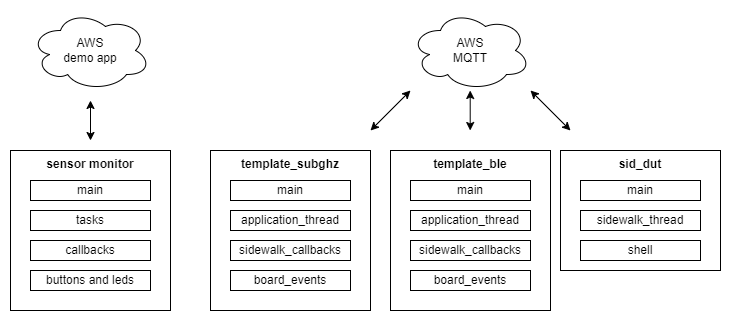
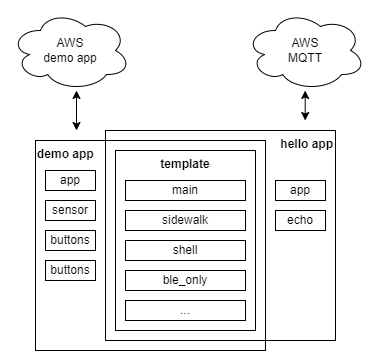

.. _why_new_sidewalk_template:

New samples migration guide
###########################

Why samples changes?
********************

The old approach to Amazon Sidewalk samples in nRF Connect SDK was to present four different samples: template sub-GHz, template BLE, sensor monitor and dut. The new approach is to present the same functionalities in the one, unified, configurable template sample.

   Old samples approach. Separate sample for every configuration.

   New template sample. Common, configurable code base.

After samples unification is will be easier to adopt new features from Amazon Sidewalk and nRF Connect SDK, maintain samples codebase and understand Sidewalk application for new developers.

.. put diagram here

How to align changes?
*********************

In general you can still use applications based on old samples.
We encourage you to align your application to new sample as it is more futureproof.

Besides sample unification some other changes were made in sdk-sidewalk codebase recently, which my affect your code. To use deprecated functionalities you have to enable suitable config options:

* ``CONFIG_DEPRECATED_SIDEWALK_PAL_INIT`` -- Enable to initialize platform components from :file:`pal_init.c`. The initialization was moved to :file:`sid_common.c` and is called during ``sid_init()``.
* ``DEPRECATED_SIDEWALK_BLE_MAC_ADDR_TYPE`` -- Enable to switch Bluetooth LE Mac address type for Sidewalk application. These configs was redundant to nRF Connect SDK Bluetooth configurations.
* ``DEPRECATED_DFU_FLAG_SETTINGS_KEY`` -- Enable to save dfu mode after reset. The new template uses :ref:`why_new_sidewalk_template_dfu_mode`.
* ``CONFIG_SIDEWALK_LINK_MASK`` -- Choose sidewalk link mask to start with. The new Sidewalk libraries supports link switch in runtime. To switch between full link mask support libraries and Bluetooth LE only libraries use ``CONFIG_SIDEWALK_SUBGHZ_SUPPORT``.

What was changed?
*****************

To make alignment with new template easier, some aspects of work with samples was presented below. Please note, that this is not 1:1 instructions, but rather a generic guide to understand changes.

Building
--------

All below commands assumes you are in :file:`{NCS_PATH}/sidewalk/samples` and build for nRF52840 Development Kit board.

+---------------------------+---------------------------------------------------------+----------------------------------------------------------------------------------------------+
| Description               | Old                                                     | New                                                                                          |
+===========================+=========================================================+==============================================================================================+
| Template sub-GHz          | ``west build -b nrf52840dk_nrf52840 template_subghz``   | ``west build -b nrf52840dk_nrf52840 template``                                               |
+---------------------------+---------------------------------------------------------+----------------------------------------------------------------------------------------------+
| Template Bluetooth LE only| ``west build -b nrf52840dk_nrf52840 template_ble``      | ``west build -b nrf52840dk_nrf52840 template -- -DCONFIG_SIDEWALK_SUBGHZ_SUPPORT=y``         |
+---------------------------+---------------------------------------------------------+----------------------------------------------------------------------------------------------+
| Sensor monitoring demo    | ``west build -b nrf52840dk_nrf52840 sensor_monitoring`` | ``west build -b nrf52840dk_nrf52840 template -- -DCONFIG_TEMPLATE_APP_SENSOR_MONITORING=y``  |
+---------------------------+---------------------------------------------------------+----------------------------------------------------------------------------------------------+
| Device under test (CLI)   |``west build -b nrf52840dk_nrf52840 sid_dut``            | ``west build -b nrf52840dk_nrf52840 template -- -DOVERLAY_CONFIG="overlay-dut.conf"``        |
+---------------------------+---------------------------------------------------------+----------------------------------------------------------------------------------------------+

User interface
--------------

The user interface was changed in Sidewalk template, to better support board with smaller amount of buttons and leds.

**Buttons** changes:

+--------------------------------+--------------------------+-------------------------+
| Description                    | Old                      | New                     |
+================================+==========================+=========================+
| Send Hello                     | ``Button 3 (short)``     | ``Button 1 (short)``    |
+--------------------------------+--------------------------+-------------------------+
| Enter DFU mode                 | ``Button4 (long)``       | ``Button 1 (long)``     |
+--------------------------------+--------------------------+-------------------------+
| Factory Reset                  | ``Button1 (long)``       | ``Button 2 (long)``     |
+--------------------------------+--------------------------+-------------------------+
| Board support                  | ``board_events.c``       | N/A (use CLI command)   |
+--------------------------------+--------------------------+-------------------------+
| Set fake battery level         | ``Button 4 (short)``     | N/A (use CLI command)   |
+--------------------------------+--------------------------+-------------------------+
| Get current Device Profiles    | ``Button 2 (short)``     | N/A (use CLI command)   |
+--------------------------------+--------------------------+-------------------------+
| Switch between Device Profiles | ``Button 2 (long)``      | N/A (use CLI command)   |
+--------------------------------+--------------------------+-------------------------+
| Sensor Monitoring button press | ``Buttons 1-4 (short)``  | ``Buttons 1-4 (short)`` |
+--------------------------------+--------------------------+-------------------------+
| Switch Link Mask               | N/A                      | ``Buttons 3 (long)``    |
+--------------------------------+--------------------------+-------------------------+

**LEDs** changes:

+--------------------------------+--------------+--------------+
| Description                    | Old          | New          |
+================================+==============+==============+
| Application Link and Connected | ``LED 1``,   | ``LED 1``    |
|                                | ``LED 4``    |              |
+--------------------------------+--------------+--------------+
| Application time sync          | ``LED 3``    | ``LED 2``    |
+--------------------------------+--------------+--------------+
| Application Registered         | ``LED 2``    | ``LED 3``    |
+--------------------------------+--------------+--------------+
| Application woke up            | N/A          | ``LED 4``    |
+--------------------------------+--------------+--------------+
| Sensor Monitoring led          | ``LEDs 1-4`` | ``LEDs 1-4`` |
+--------------------------------+--------------+--------------+

**CLI** changes:

* All Sidewalk Device Under Test application (``sid_dut``) commands are available when ``CONFIG_TEMPLATE_APP_CLI`` is enabled.
* Old ``CONFIG_SIDEWALK_CLI`` was removed.

Source files
------------

Sample file structure was refactored, to make sample unification possible.
The table below presents where most of components was moved form old template to new template.

+--------------------------------+--------------------------+----------------+
| Description                    | Old                      | New            |
+================================+==========================+================+
| Sidewalk thread implementation | ``application_thread.c`` | ``sidewalk.c`` |
+--------------------------------+--------------------------+----------------+
| Sidewalk thread events         | ``application_thread.h`` | ``sidewalk.h`` |
+--------------------------------+--------------------------+----------------+
| Sidewalk callbacks             | ``sidewalk_callbacks.c`` | ``app.c``      |
+--------------------------------+--------------------------+----------------+
| Board support                  | ``board_events.c``       | ``app.c``      |
+--------------------------------+--------------------------+----------------+
| Application logic              | ``main.c``               | ``app.c``      |
+--------------------------------+--------------------------+----------------+

Events
------

In nRF Connect SDK all Sidewalk API calls should be made form the same thread where ``sid_process()`` is called.
In both old and new samples communication with Sidewalk thread was handled by user defined events. To cover all scenarios in the unified template sample, the events has changed: there are more events, the event was renamed, and it may provide Sidewalk thread a specific context.

**Events naming** changes was presented in table below:

+--------------------------------+-------------------------------------+-----------------------------+
| Description                    | Old                                 | New                         |
+================================+=====================================+=============================+
| Sidewalk process event         | ``SIDEWALK_EVENT``                  | ``SID_EVENT_SIDEWALK``      |
+--------------------------------+-------------------------------------+-----------------------------+
| Send message                   | ``BUTTON_EVENT_SEND_HELLO``         | ``SID_EVENT_SEND_MSG``      |
+--------------------------------+-------------------------------------+-----------------------------+
| Set connection request         | ``BUTTON_EVENT_CONNECTION_REQUEST`` | ``SID_EVENT_CONNECT``       |
+--------------------------------+-------------------------------------+-----------------------------+
| Factory reset                  | ``BUTTON_EVENT_FACTORY_RESET``      | ``SID_EVENT_FACTORY_RESET`` |
+--------------------------------+-------------------------------------+-----------------------------+
| Enter DFU mode                 | ``BUTTON_EVENT_NORDIC_DFU.c``       | ``SID_EVENT_NORDIC_DFU``    |
+--------------------------------+-------------------------------------+-----------------------------+
| Set battery option,            | ``BUTTON_EVENT_SET_BATTERY_LEVEL``  | ``DUT_EVENT_SET_OPTION``    |
| Set device profile option      | ``BUTTON_EVENT_SET_DEVICE_PROFILE`` |                             |
+--------------------------------+-------------------------------------+-----------------------------+
| Get device profile option      | ``BUTTON_EVENT_GET_DEVICE_PROFILE`` | ``DUT_EVENT_GET_OPTION``    |
+--------------------------------+-------------------------------------+-----------------------------+
| New events                     | N/A                                 | ``SID_EVENT_LINK_SWITCH``   |
|                                |                                     | ``SID_EVENT_NEW_STATUS``    |
|                                |                                     | ``DUT_EVENT_INIT``          |
|                                |                                     | ``DUT_EVENT_DEINIT``        |
|                                |                                     | ``DUT_EVENT_START``         |
|                                |                                     | ``DUT_EVENT_STOP``          |
|                                |                                     | ``DUT_EVENT_GET_MTU``       |
|                                |                                     | ``DUT_EVENT_GET_TIME``      |
|                                |                                     | ``DUT_EVENT_GET_STATUS``    |
|                                |                                     | ``DUT_EVENT_SET_DEST_ID``   |
+--------------------------------+-------------------------------------+-----------------------------+

**Sending event** procedure, on example of sending hello message to cloud. Some part of the code was removed to make it easier to read.

Old template:

.. code:: c

  // main.c
  app_event_send(BUTTON_EVENT_SEND_HELLO);

  // application_thread.c
  switch (event) {
  case BUTTON_EVENT_SEND_HELLO:
      button_event_send_hello(application_ctx);
      break;
  }

  // board_events.c
  void button_event_send_hello(app_ctx_t *application_ctx)
  {
      const char payload[] = "hello";
      struct sid_msg msg;
      msg.data = &payload;
      msg.size = sizeof(payload);
      struct sid_msg_desc desc;
      desc.type = SID_MSG_TYPE_NOTIFY;
      desc.link_type = SID_LINK_TYPE_ANY;
      desc.link_mode = SID_LINK_MODE_CLOUD;

      sid_put_msg(application_ctx->handle, &msg, &desc);
  }

New template:

.. code:: c

  // app.c
  const char payload[] = "hello";
  sidewalk_msg_t *hello = sidewalk_data_alloc(sizeof(sidewalk_msg_t));
  hello->msg.size = sizeof(payload);
  hello->msg.data = sidewalk_data_alloc(hello->msg.size);
  memcpy(hello->msg.data, payload, hello->msg.size);
  hello->desc.type = SID_MSG_TYPE_NOTIFY;
  hello->desc.link_type = SID_LINK_TYPE_ANY;
  hello->desc.link_mode = SID_LINK_MODE_CLOUD;

  sidewalk_event_send(SID_EVENT_SEND_MSG, hello);

  // sidewalk.c
  switch (sm->event.id) {
  case SID_EVENT_SEND_MSG:
      sidewalk_msg_t *p_msg = (sidewalk_msg_t *)sm->event.ctx;
      sid_put_msg(sm->sid->handle, &p_msg->msg, &p_msg->desc);
      sidewalk_data_free(p_msg->msg.data);
      sidewalk_data_free(p_msg);
      break;
  }

**Handling event** procedure, on example of handling Sidewalk process event. Some part of the code was removed to make it easier to read.

Old template:

.. code:: c

    // context
    typedef struct application_context {
        struct sid_event_callbacks event_callbacks;
        struct sid_config config;
        struct sid_handle *handle;
    } app_ctx_t;

    static void sidewalk_app_entry(void *ctx, void *unused, void *unused2)
    {
        // init
        sid_init(&application_ctx->config, &application_ctx->handle);
        sid_start(application_ctx->handle, BUILT_IN_LM);

        // process
        while (true) {
            app_event_t event = SIDEWALK_EVENT;

            if (!k_msgq_get(&application_thread_msgq, &event, K_FOREVER)) {
                switch (event) {
                    case SIDEWALK_EVENT:
                        sid_process(application_ctx->handle);
                }
            }
        }
    }

    // thread start
    sid_error_t app_thread_init(app_ctx_t *context)
    {
        k_thread_create(sidewalk_app_entry, context);

    }

    // event send
    void app_event_send(app_event_t event)
    {
        k_msgq_put(&application_thread_msgq, (void *)&event, K_NO_WAIT);
    }

New template:

.. code:: c

    // context
    typedef struct {
        struct sid_handle *handle;
        struct sid_config config;
        struct sid_status last_status;
    } sidewalk_ctx_t;

    typedef struct {
        struct smf_ctx ctx;
        struct k_msgq msgq;
        sidewalk_ctx_event_t event;
        sidewalk_ctx_t *sid;
    } sm_t;

    // init
    static void state_sidewalk_entry(void *o)
    {
        sm_t *sm = (sm_t *)o;
        sid_init(&sm->sid->config, &sm->sid->handle);
        sid_start(sm->sid->handle, sm->sid->config.link_mask);
    }

    // process
    static void state_sidewalk_run(void *o)
    {
        sm_t *sm = (sm_t *)o;

        switch (sm->event.id) {
            case SID_EVENT_SIDEWALK:
                sid_process(sm->sid->handle);
            break;
        }
    }

    static void sid_thread_entry(void *context, void *unused, void *unused2)
    {
        while (true) {
            k_msgq_get(&sid_sm.msgq, &sid_sm.event, K_FOREVER);
            smf_run_state(SMF_CTX(&sid_sm))
        }
    }

    // thread start
    void sidewalk_start(sidewalk_ctx_t *context)
    {
        (void)k_thread_create(sid_thread_entry, context);
    }

    // event send
    int sidewalk_event_send(sidewalk_event_t event, void *ctx)
    {
        sidewalk_ctx_event_t ctx_event = {
            .id = event,
            .ctx = ctx,
        };

        return k_msgq_put(&sid_sm.msgq, (void *)&ctx_event, K_NO_WAIT);
    }

.. _why_new_sidewalk_template_dfu_mode:

Sidewalk and custom Bluetooth Service
-------------------------------------

The new template samples uses `Zephyr State Machine Framework`_.
In :file:`sidewalk.c` the state machine is used to demonstrate how application can switch between Sidewalk and `Zephyr SMP Server`_ application.
You can use this as a reference design for switching between Sidewalk mode and another Bluetooth LE service based application.

.. _Zephyr State Machine Framework: https://developer.nordicsemi.com/nRF_Connect_SDK/doc/latest/zephyr/services/smf/index.html#state-machine-framework

.. _Zephyr SMP Server: https://developer.nordicsemi.com/nRF_Connect_SDK/doc/latest/zephyr/samples/subsys/mgmt/mcumgr/smp_svr/README.html#smp-svr
